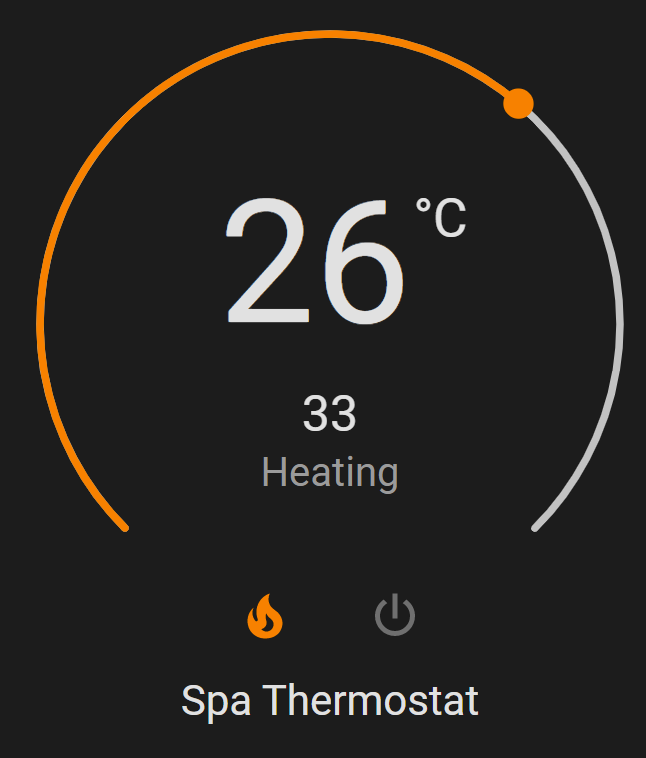
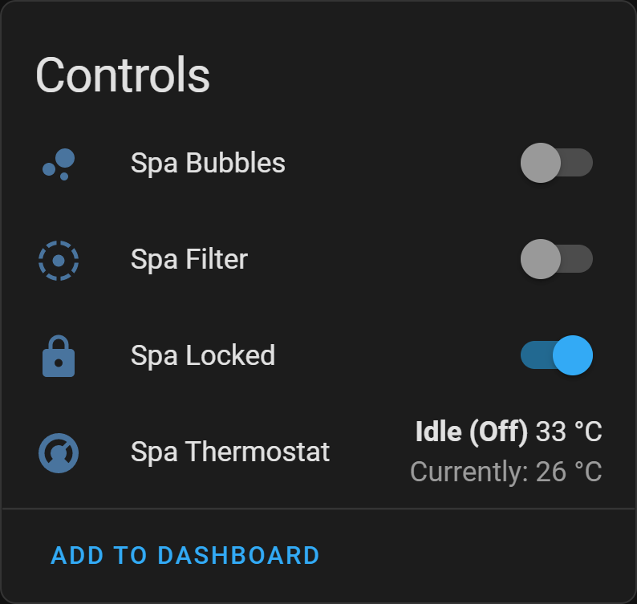
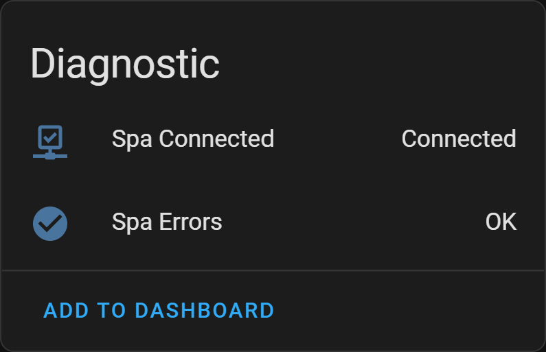

# Bestway

[![GitHub Release][releases-shield]][releases]
[![GitHub Activity][commits-shield]][commits]
[![License][license-shield]](LICENSE)
[![hacs][hacsbadge]][hacs]

This custom component integrates with the Bestway cloud API, providing control of devices such as Lay-Z-Spa hot tubs and Flowclear pool filters.

  
  
  

## Required Account

You must have an account with the Bestway mobile app ([Android][bestway-android]/[iOS][bestway-ios]). Lay-Z-Spa app credentials will not work. Both apps appear to have identical feature sets.

Bestway uses different API endpoints for EU and US. If you get an error stating account could not be found, try using the other endpoint. If this does not help, then create a new account under a supported country.

## Device Support

A Wi-Fi enabled model is required. No custom hardware is required.

See the [supported devices](docs/supported-devices.md) list for more details.

## Installation

This integration is delivered as a HACS custom repository.

1. Download and install [HACS][hacs-download].
2. Add a [custom repository][hacs-custom] in HACS. You will need to enter the URL of this repository when prompted: `https://github.com/cdpuk/ha-bestway`.

## Configuration

Ensure you can control your device using the Bestway mobile app. At time of writing, there was also a Lay-Z-Spa branded app, but despite this being the recommended app in the installation manual, the spa could not be added. The Bestway app worked flawlessly.

- Go to **Configuration** > **Devices & Services** > **Add Integration**, then find **Bestway** in the list.
- Enter your Bestway username and password when prompted.

## Update speed

Any changes made to the spa settings via the Bestway app or physical controls can take a short amount of time to be reflected in Home Assistant. This delay is typically under 30 seconds, but can sometimes extend to a few minutes.

## Improvement ideas

Achieve faster (or even local) updates.

- Capture more traffic from the mobile app to work out how it receives updates so quickly.
- The integration currently has to poll, but the mobile app is able to reflect changes based on physical button presses within a fraction of a second.
- A brief recent attempt suggested that the Android app may have certificate pinning enabled, making this slightly harder than expected. Perhaps decompilation is an easier route.
- We know the spa talks directly to the cloud using MQTT. Traffic captures against the Android app appeared to show only HTTPS traffic.

## Acknowledgements

- https://github.com/B-Hartley/bruces_homeassistant_config

## Contributing

If you want to contribute to this please read the [Contribution Guidelines](CONTRIBUTING.md).

[commits-shield]: https://img.shields.io/github/commit-activity/y/cdpuk/ha-bestway.svg?style=for-the-badge
[commits]: https://github.com/cdpuk/ha-bestway/commits/main
[hacs]: https://github.com/custom-components/hacs
[hacsbadge]: https://img.shields.io/badge/HACS-Custom-orange.svg?style=for-the-badge
[license-shield]: https://img.shields.io/github/license/cdpuk/ha-bestway.svg?style=for-the-badge
[releases-shield]: https://img.shields.io/github/release/cdpuk/ha-bestway.svg?style=for-the-badge
[releases]: https://github.com/cdpuk/ha-bestway/releases
[hacs-download]: https://hacs.xyz/docs/setup/download
[hacs-custom]: https://hacs.xyz/docs/faq/custom_repositories
[bestway-android]: https://play.google.com/store/apps/details?id=com.layzspa.smartHome
[bestway-ios]: https://apps.apple.com/us/app/bestway-smart-hub/id1456731336
