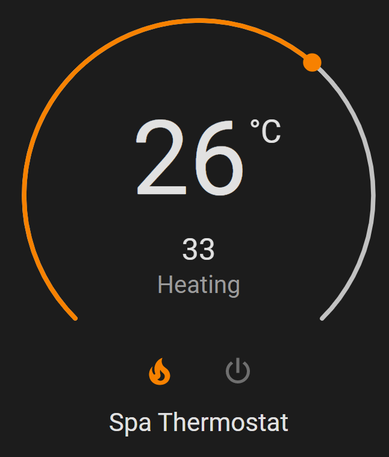
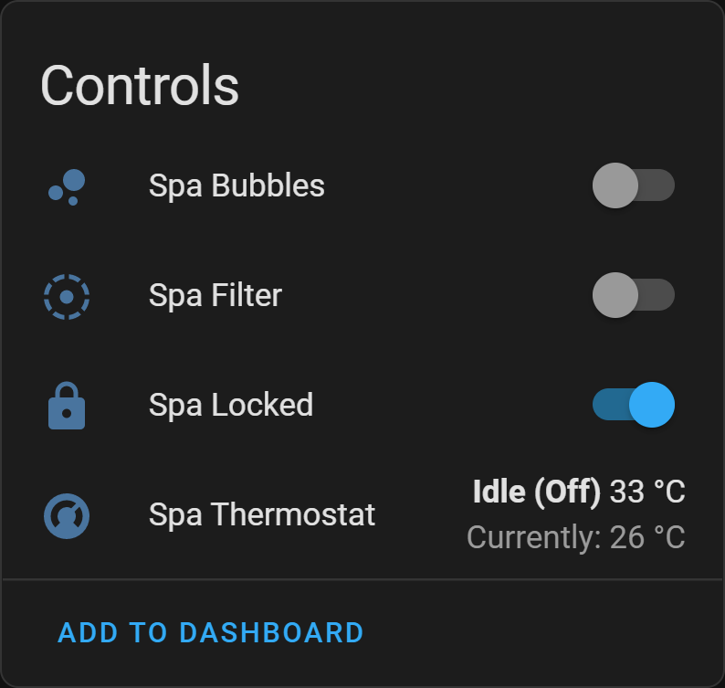
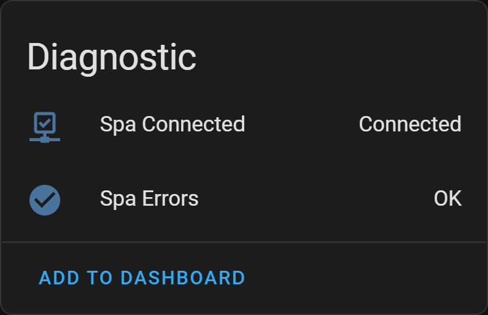

# Bestway

[![GitHub Release][releases-shield]][releases]
[![GitHub Activity][commits-shield]][commits]
[![License][license-shield]](LICENSE)
[![hacs][hacsbadge]][hacs]

This custom component integrates with the Bestway cloud API, providing control of devices such as Lay-Z-Spa hot tubs and Flowclear pool filters.

  
  
  

## Device Support

A Wi-Fi enabled model is required. No custom hardware is required.

This integration supports two main generations of devices (V1 and V2), which must be selected when adding your device to Home Assistant. Broadly speaking:

- V1 covers older models up to around 2024.
- V2 covers newer models with UltraFit pumps from 2025 onwards.

See the [supported devices](docs/supported-devices.md) list for more details.

## Installation

This integration is delivered as a HACS custom repository.

1. Download and install [HACS][hacs-download].
2. Add a [custom repository][hacs-custom] in HACS. You will need to enter the URL of this repository when prompted: `https://github.com/cdpuk/ha-bestway`.

## Configuration

Initial configuration must be done via the relevant mobile app. Bestway have published no less than three different apps, so care must be taken to use the right one.

- V1 models must be configured via the Bestway Smart Hub app ([Android][bestway-android]/[iOS][bestway-ios]). We have found that the spa can also be controlled via the Lay-Z-Spa Wi-Fi app ([Android][layzspa-android]/[iOS][layzspa-ios]), but this integration will not accept credentials from that app.

- V2 models must be configured via the Bestway Connect app ([Android][bestway-connect-android]/[iOS][bestway-connect-ios]). Users have reported that the Lay-Z-Spa Wi-Fi app will control devices, but does not provide the crucial sharing QR code described below.

With this done, open Home Assistant and go to **Configuration** > **Devices & Services** > **Add Integration**, then find **Bestway** in the list.

The process varies depending on model:

- V1 models require your Bestway username and password. You must also select the required region (EU or US).

- V2 models require a scan of the QR code from the Lay-Z-Spa app settings. You must also select the required region (Europe, US or China).

All devices in your account will be automatically detected and added by the integration.

**Region selection:** Users have reported that the actual region for accounts is not necessarily as expected. If your first guess doesn't work (either failing to log in, or no devices found), try another region.

## Contributing

If you want to contribute to this please read the [Contribution Guidelines](CONTRIBUTING.md).

[commits-shield]: https://img.shields.io/github/commit-activity/y/cdpuk/ha-bestway.svg?style=for-the-badge
[commits]: https://github.com/cdpuk/ha-bestway/commits/main
[hacs]: https://github.com/custom-components/hacs
[hacsbadge]: https://img.shields.io/badge/HACS-Custom-orange.svg?style=for-the-badge
[license-shield]: https://img.shields.io/github/license/cdpuk/ha-bestway.svg?style=for-the-badge
[releases-shield]: https://img.shields.io/github/release/cdpuk/ha-bestway.svg?style=for-the-badge
[releases]: https://github.com/cdpuk/ha-bestway/releases
[hacs-download]: https://hacs.xyz/docs/setup/download
[hacs-custom]: https://hacs.xyz/docs/faq/custom_repositories
[bestway-android]: https://play.google.com/store/apps/details?id=com.layzspa.smartHome
[bestway-ios]: https://apps.apple.com/us/app/bestway-smart-hub/id1456731336
[layzspa-android]: https://play.google.com/store/apps/details?id=com.wiltonbradley.layzspaapp
[layzspa-ios]: https://apps.apple.com/gb/app/lay-z-spa-wifi-app/id6736467418
[bestway-connect-android]: https://play.google.com/store/apps/details?id=com.bestway.smartspa
[bestway-connect-ios]: https://apps.apple.com/gb/app/bestway-connect-smartspa/id6503030222
