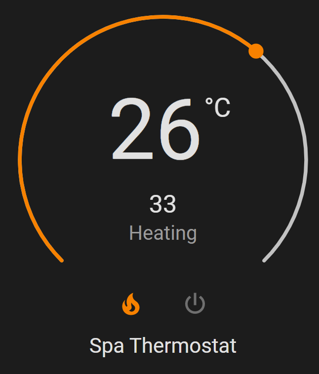
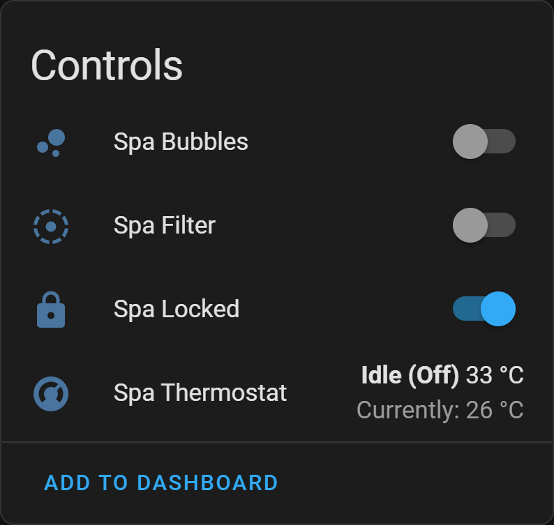
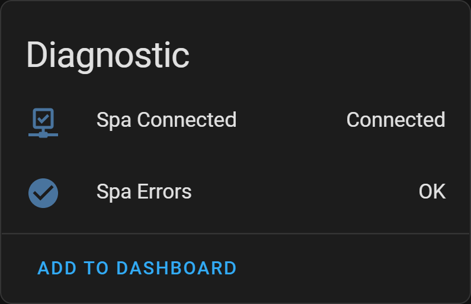

# Bestway

[![GitHub Release][releases-shield]][releases]
[![GitHub Activity][commits-shield]][commits]
[![License][license-shield]](LICENSE)
[![hacs][hacsbadge]][hacs]

This custom component integrates with the Bestway cloud API, providing control of devices such as Lay-Z-Spa hot tubs and Flowclear pool filters.

  
  
  

## Device Support

A Wi-Fi enabled model is required. No custom hardware is required.

This integration supports two main generations of devices (V1 and V2), which must be selected when adding your device to Home Assistant. Broadly speaking:

- V1 covers older models up to around 2024.
- V2 covers newer models from 2025 onwards. Bestway have moved these across two different cloud backends, so there are two V2 options to choose between; [Configuration](#configuration) explains which one your device needs.

See the [supported devices](docs/supported-devices.md) list for confirmed examples of each.

## Installation

This integration is delivered as a HACS custom repository.

1. Download and install [HACS][hacs-download].
2. Add a [custom repository][hacs-custom] in HACS. You will need to enter the URL of this repository when prompted: `https://github.com/cdpuk/ha-bestway`.

## Configuration

Initial configuration must be done via the relevant mobile app. Bestway have published no less than three different apps, so care must be taken to use the right one.

- V1 models must be configured via the Bestway Smart Hub app ([Android][bestway-android]/[iOS][bestway-ios]). We have found that the spa can also be controlled via the Lay-Z-Spa Wi-Fi app ([Android][layzspa-android]/[iOS][layzspa-ios]), but this integration will not accept credentials from that app.

- V2 models must be configured via the Bestway Connect app ([Android][bestway-connect-android]/[iOS][bestway-connect-ios]). Users have reported that the Lay-Z-Spa Wi-Fi app will control devices, but does not provide the crucial sharing QR code described below.

With this done, open Home Assistant and go to **Configuration** > **Devices & Services** > **Add Integration**, then find **Bestway** in the list. The first step asks which backend to use, and the options below map onto that choice.

- **V1 - Bestway Smart Hub (Gizwits)** requires your Bestway username and password. You must also select the required region (EU or US).

- **V2 - Bestway Connect (AWS IoT)** requires a scan of the sharing QR code from the Bestway Connect app (Settings > Device Sharing), plus the required region (Europe, US or China). The code decodes to text beginning `RW_Share_`. If yours decodes to a URL instead, the app that produced it has been updated since July 2026 and this backend cannot accept it - use the account-login option instead.

- **V2 - Bestway Connect account login (SmartSpa gateway)** requires the email address and password of your Bestway Connect account, plus the required region (Europe, US or China). This is the option for a device paired by a Bestway Connect app updated after July 2026, where "Share device" produces a share link addressed to an account rather than an anonymous QR code, and no QR code is involved at any point. It is also the option to move to if a spa added by visitor ID stops executing commands: after the app has been logged into with a real account, the visitor session keeps looking connected while the spa ignores it.

If your Bestway Connect app has only ever offered guest access, the account login needs a real account first. There is no "add email/password" setting to find: open the app's profile area, log out, log back in choosing **email** instead of **guest** - a button for it appears on the login screen - and enter your email with any password. That login fails, and the failure is what offers the **sign-up** option. Afterwards the device has to be paired again (scan the pump's barcode); a device paired to a guest identity does not carry over.

All devices in your account will be automatically detected and added by the integration.

**Region selection:** Users have reported that the actual region for accounts is not necessarily as expected. If your first guess doesn't work (either failing to log in, or no devices found), try another region.

## Contributing

If you want to contribute to this please read the [Contribution Guidelines](CONTRIBUTING.md).

[commits-shield]: https://img.shields.io/github/commit-activity/y/cdpuk/ha-bestway.svg?style=for-the-badge
[commits]: https://github.com/cdpuk/ha-bestway/commits/main
[hacs]: https://github.com/custom-components/hacs
[hacsbadge]: https://img.shields.io/badge/HACS-Custom-orange.svg?style=for-the-badge
[license-shield]: https://img.shields.io/github/license/cdpuk/ha-bestway.svg?style=for-the-badge
[releases-shield]: https://img.shields.io/github/release/cdpuk/ha-bestway.svg?style=for-the-badge
[releases]: https://github.com/cdpuk/ha-bestway/releases
[hacs-download]: https://hacs.xyz/docs/setup/download
[hacs-custom]: https://hacs.xyz/docs/faq/custom_repositories
[bestway-android]: https://play.google.com/store/apps/details?id=com.layzspa.smartHome
[bestway-ios]: https://apps.apple.com/us/app/bestway-smart-hub/id1456731336
[layzspa-android]: https://play.google.com/store/apps/details?id=com.wiltonbradley.layzspaapp
[layzspa-ios]: https://apps.apple.com/gb/app/lay-z-spa-wifi-app/id6736467418
[bestway-connect-android]: https://play.google.com/store/apps/details?id=com.bestway.smartspa
[bestway-connect-ios]: https://apps.apple.com/gb/app/bestway-connect-smartspa/id6503030222
